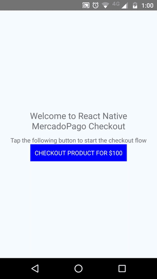

React Native Checkout MercadoPago
=============
This package provides a bridge to trigger MercadoPago UI components (Android and iOS) from a react-native app. For more info about the native MercadoPago components, checkout the official documentation: [Android](http://mercadopago.github.io/px-android/) and [iOS](http://mercadopago.github.io/px-ios/)



## Setup

Install with npm: `npm install --save react-native-checkout-mercadopago`.

Or, install with yarn: `yarn add react-native-checkout-mercadopago`.

Either way, then link with `react-native link react-native-checkout-mercadopago`.

### iOS

1. Download MercadoPago´s [SDK for iOS](https://github.com/mercadopago/px-ios).
2. Open your project in XCode and drag MercadoPagoSDK.xcodeproj into the 'Libraries' folder of your app.
3. Navigate to the target configuration window by clicking on the blue project icon, and selecting the application target under the "Targets" heading in the sidebar.
4. In the 'General' panel, go to the 'Embedded Binaries' section.
5. Click on the '+' button and select 'MercadoPagoSDK.framework' under `Libraries > MercadoPagoSDK.xcodeproj > Products` from your project
 
## Usage

```javascript
import { startCheckout } from 'react-native-checkout-mercadopago';

//from your checkout button, start the checkout process like this:
let payment = await startCheckout('my_public_key', 'my_preference_id');
```
## Example

Check out the `/example` directory for a working demo of a react-native app triggering the MercadoPago components.
